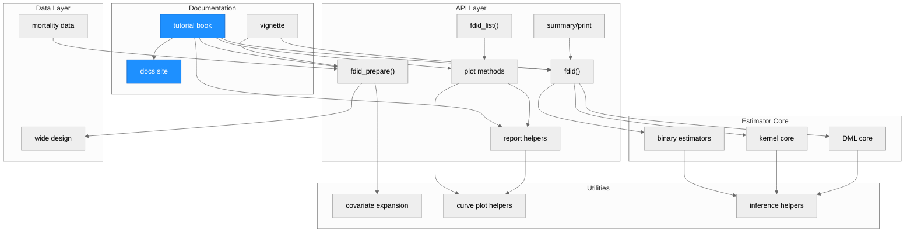
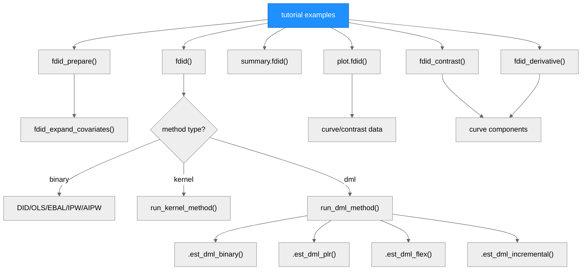
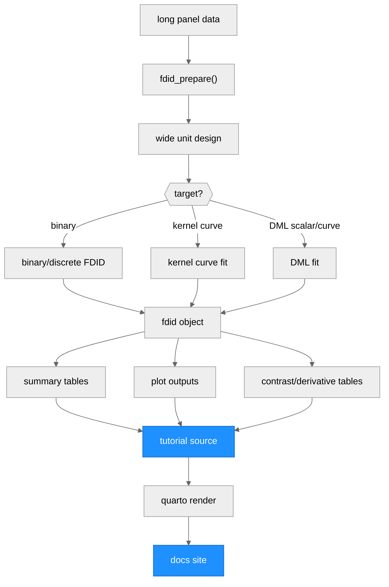

# Architecture - fdid

> Generated by scriber for run `TUTORIAL-ENRICH-20260601-0001` on 2026-06-01.

## Overview

`fdid` is an R package for Factorial Difference-in-Differences workflows. The
package prepares long panel data into a wide unit-level design, estimates
binary/discrete and continuous baseline-factor FDID targets, reports fitted
objects through summaries and continuous-G helper tables, and renders a Quarto
book tutorial under `tutorial/` into the public `docs/` site.

---

## Module Structure

### Module Reference

| Module / File | Layer | Purpose | Key Exports | Changed |
| --- | --- | --- | --- | --- |
| `tutorial/*.Rmd`, `tutorial/*.qmd` | Documentation | Quarto source for the public user manual. | n/a | yes |
| `docs/` | Documentation | Rendered public tutorial site and generated figure assets. | n/a | yes |
| `vignettes/fdid.Rmd` | Documentation | Package vignette entry point. | n/a | no |
| `R/fdid.R` | API | Main estimator dispatcher and binary/discrete FDID implementation. | `fdid()` | no |
| `R/fdid_prepare.R` | API/Data | Long-to-wide data preparation and covariate expansion. | `fdid_prepare()`, `fdid_expand_covariates()` | no |
| `R/kernel.R` | Core | Continuous-G kernel level and derivative estimation. | internal `run_kernel_method()` | no |
| `R/dml.R` | Core | Binary DML, PLR, flexible curve, and incremental DML estimators. | internal `run_dml_method()` | no |
| `R/reporting.R` | API/Utils | Continuous-G contrast and derivative table helpers. | `fdid_contrast()`, `fdid_derivative()` | no |
| `R/plot.R` | API/Utils | Base graphics plots for raw, dynamic, overlap, curve, and contrast views. | `plot.fdid()` | no |
| `R/plot.fdid_list.R` | API | Multi-fit comparison plot wrapper. | `fdid_list()`, `plot.fdid_list()` | no |
| `R/summary.R`, `R/print.R` | API | Text display for fitted objects. | `summary.fdid()`, `print.fdid()` | no |

---

## Function Call Graph

### Function Reference

| Function | Defined In | Called By | Calls | Changed | Purpose |
| --- | --- | --- | --- | --- | --- |
| `fdid_prepare()` | `R/fdid_prepare.R` | Tutorial, users | `fdid_expand_covariates()` | no | Convert long panel data to the wide unit-level design. |
| `fdid_expand_covariates()` | `R/fdid_prepare.R` | Tutorial, `fdid_prepare()` | basis builders | no | Expand covariate design for DML learners. |
| `fdid()` | `R/fdid.R` | Tutorial, users | binary core, `run_kernel_method()`, `run_dml_method()` | no | Dispatch to the requested FDID estimator. |
| `run_kernel_method()` | `R/kernel.R` | `fdid()` | local linear and bootstrap helpers | no | Estimate continuous-G kernel level and derivative curves. |
| `run_dml_method()` | `R/dml.R` | `fdid()` | `.est_dml_*()` helpers | no | Dispatch DML estimators and attach DML metadata. |
| `.est_dml_binary()` | `R/dml.R` | `run_dml_method()` | nuisance learners, score inference | no | Estimate binary-G AIPW/IRM DML contrast. |
| `.est_dml_flex()` | `R/dml.R` | `run_dml_method()` | density and signal-map helpers | no | Estimate DML level and derivative curves. |
| `fdid_contrast()` | `R/reporting.R` | Tutorial, users, plots | curve components and inference fallback helpers | no | Report continuous-G level or derivative contrasts. |
| `fdid_derivative()` | `R/reporting.R` | Tutorial, users | curve components and inference fallback helpers | no | Report fixed-G derivative values. |
| `plot.fdid()` | `R/plot.R` | Tutorial, users | curve, support, and contrast plot helpers | no | Draw fitted FDID results. |
| `summary.fdid()` | `R/summary.R` | Tutorial, users | display helpers | no | Print scalar, curve, and DML metadata summaries. |

---

## Data Flow

---

## Architectural Patterns

- **Single estimator dispatcher**: `fdid()` owns method validation and routes
  continuous-G work to specialized kernel and DML modules.
- **Prepared wide design**: all estimators consume the same prepared unit-level
  object with `G`, `x*` covariates, `Y_*` outcome columns, and optional cluster
  column `c`.
- **Target-first tutorial structure**: the tutorial mirrors the package's
  target distinctions: binary contrasts, kernel curves, DML scalar/curve
  targets, plotting, and sensitivity.
- **Stored curve reporting**: plots and reporting helpers use stored curve
  data and the best available covariance, replicate, band, or pointwise source.

---

## Notes

- This run changed tutorial source, rendered `docs/`, public-branch markdown
  cleanup, and this architecture document only. Estimator and R source code
  were intentionally left unchanged.
- The standalone reporting/inference chapter was removed; reporting is now
  documented inside the estimator and visualization chapters.
