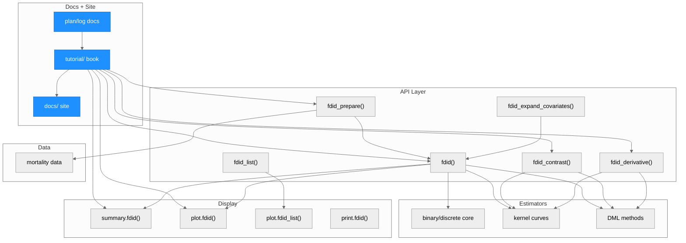
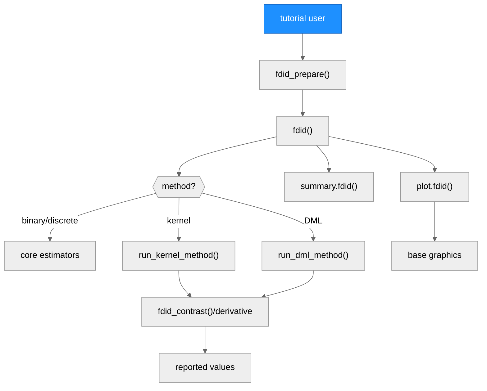
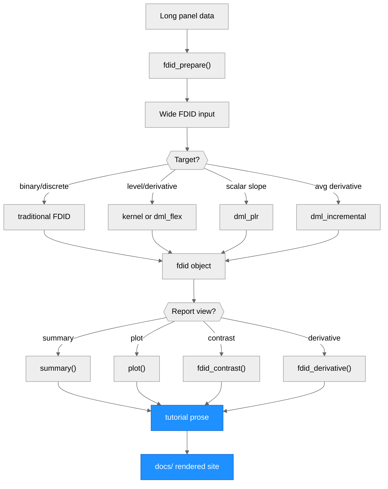

# Architecture — fdid

> Generated by scriber for run `TUTORIAL-CLEANUP-20260531-170459` on 2026-05-31.

## Overview

`fdid` is an R package for Factorial Difference-in-Differences designs with
binary, discrete, and continuous baseline factors. The public API prepares
panel data, estimates FDID models, reports summaries/contrasts/derivatives,
and displays results with S3 methods. This run changed documentation and site
artifacts only; estimator, inference, and plotting implementation modules were
not edited.

---

## Module Structure

### Module Reference

| Module / File | Layer | Purpose | Key Exports | Changed |
| --- | --- | --- | --- | --- |
| `tutorial/` | Docs + Site | Canonical Quarto tutorial source | n/a | yes |
| `docs/` | Docs + Site | Rendered GitHub Pages tutorial | n/a | yes |
| root project plans/logs | Docs + Site | Cleanup plan, TODO, plotting-plan sequence, project log | n/a | yes |
| `R/fdid_prepare.R` | API | Data preparation and covariate expansion | `fdid_prepare()`, `fdid_expand_covariates()` | no |
| `R/fdid.R` | API + Core | Main estimator entry point and binary/discrete methods | `fdid()` | no |
| `R/kernel.R` | Estimators | Continuous-`G` kernel level and derivative curves | internal | no |
| `R/dml.R` | Estimators | DML binary, PLR, flexible curve, and incremental methods | internal | no |
| `R/reporting.R` | Reporting | Curve contrast and derivative reporting helpers | `fdid_contrast()`, `fdid_derivative()` | no |
| `R/summary.R` | Display | S3 summary method | `summary.fdid()` | no |
| `R/plot.R` | Display | S3 plotting for raw, dynamic, overlap, curve, and contrast displays | `plot.fdid()` | no |
| `R/plot.fdid_list.R` | Display | Method comparison plot for `fdid_list` objects | `plot.fdid_list()` | no |
| `R/data.r` | Data | Mortality example data documentation | `mortality` | no |

---

## Function Call Graph

### Function Reference

| Function | Defined In | Called By | Calls | Changed | Purpose |
| --- | --- | --- | --- | --- | --- |
| `fdid_prepare()` | `R/fdid_prepare.R` | users/tutorial | dplyr/tidyr reshaping | no | Convert long panel data to wide FDID input |
| `fdid()` | `R/fdid.R` | users/tutorial | binary/discrete core, kernel, DML dispatch | no | Main estimation entry point |
| `run_kernel_method()` | `R/kernel.R` | `fdid()` | local smoothing internals | no | Estimate continuous-`G` kernel curves |
| `run_dml_method()` | `R/dml.R` | `fdid()` | DML nuisance and signal helpers | no | Estimate DML targets |
| `fdid_contrast()` | `R/reporting.R` | users/tutorial | curve extraction, vcov/replicate/band helpers | no | Report fixed-reference level contrasts |
| `fdid_derivative()` | `R/reporting.R` | users/tutorial | derivative extraction helpers | no | Report fixed-`G` derivative values |
| `summary.fdid()` | `R/summary.R` | users/tutorial | fitted object fields | no | Print scalar/dynamic summaries |
| `plot.fdid()` | `R/plot.R` | users/tutorial | plot-data helpers, base graphics | no | Draw raw, dynamic, overlap, curve, and contrast plots |

---

## Data Flow

---

## Architectural Patterns

- **Single public estimation entry point**: `fdid()` dispatches methods through
  string-valued `method` options while preserving one fitted-object class.
- **Target-specific continuous-`G` methods**: kernel, `dml_plr`, `dml_flex`,
  and `dml_incremental` intentionally report different estimands.
- **Reporting helper layer**: `fdid_contrast()` and `fdid_derivative()` extract
  curve-derived quantities without adding new estimators.
- **S3 display layer**: `summary()` and `plot()` read fitted-object metadata
  and stored curves, intervals, bands, and diagnostics.
- **Source/render split**: `tutorial/` is the canonical source; `docs/` is the
  committed GitHub Pages render.

## Notes

- This run changed documentation, site output, and planning/log artifacts only.
- Package validation commands are pending tester audit by design.
- `docs/.nojekyll` is required for GitHub Pages and was restored after render.
